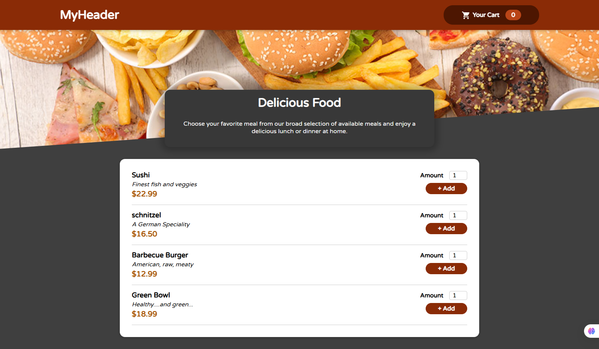

# 🍽️ Restaurant Website - React

A responsive restaurant web application built with React as a practice project while learning and applying React concepts.

The project focuses on building reusable components, managing application state, and implementing a shopping cart functionality.

## 🚀 Technologies

- React
- JavaScript (ES6+)
- HTML5
- CSS3
- Vite

## ✨ Features

- 🍔 Displaying available meals
- 🛒 Adding meals to the shopping cart
- ➕ Increasing meal quantity
- ➖ Decreasing meal quantity
- 🗑️ Removing meals from the cart
- 💰 Calculating the total price of cart items
- 🔄 Managing cart state across components
- 🧩 Reusable React components
- 📱 Responsive user interface

## 🧠 React Concepts Practiced

This project was created to practice the following React concepts:

- Functional Components
- Props
- State Management
- React Hooks
- Context API
- Event Handling
- Conditional Rendering
- Rendering Lists with `map()`
- Component Composition
- Reusable Components

## 📁 Project Structure

```text
src/
├── assets/
├── Components/
│   ├── Cart/
│   ├── Layout/
│   ├── Meals/
│   └── UI/
├── Store/
├── App.jsx
├── index.css
└── main.jsx
```

## 🔗 Preview



## 🔗 Live Demo

[View Live Demo]( https://naghmeh-me.github.io/react-restaurant/)